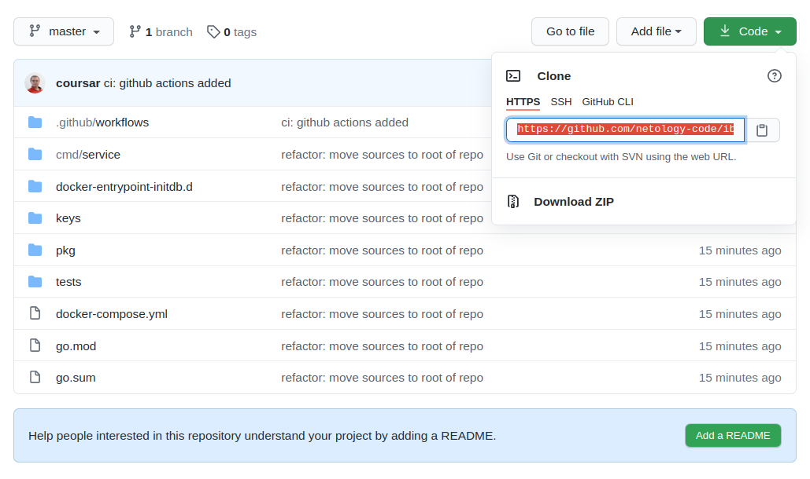
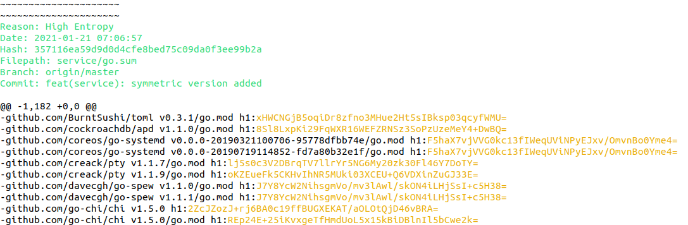
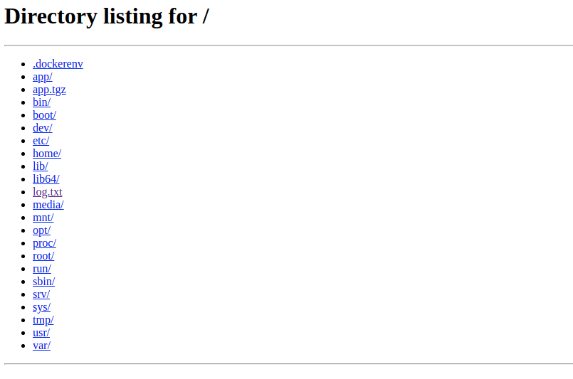

# Домашнее задание к занятию «1.3. Системы контроля версий и CI/CD»

В качестве результата отправьте ответы на вопросы в личном кабинете студента на сайте [netology.ru](https://netology.ru).

## Предисловие

Данные ДЗ будут представлять собой лабораторные работы, в рамках которых вы по инструкциям выполните определённые шаги.

## Задание truffleHog

Есть замечательный инструмент, который называется [truffleHog](https://github.com/dxa4481/truffleHog). Он умеет искать по всей истории вашего проекта «секреты». Конечно же, если ваш проект использует git.

В этой лабораторной работе мы попробуем его в использовании на более-менее реалистичном примере, чтобы вы увидели, что не всё так гладко и достаточно часто бывает много ложных срабатываний, которые приходится «разгребать». Если вы просто отдадите «простыню» логов разработчикам, чтобы они сами разбирались — ничего хорошего из этого не выйдет.

### Порядок выполнения

Для truffleHog нужен Python, устанавливается он с помощью Pip — системы управления пакетами для Python.

Вы можете проделать всё с помощью VM, но мы предлагаем рассмотреть возможность использования Docker Container' в качестве «одноразовой машины».

Итак, начнём:

1\. Поскольку нам нужен Python, да ещё и с установленным менеджером пакетов Pip, то логично найти [уже настроенный образ Python](https://hub.docker.com/_/python).

2\. На момент написания этого ДЗ (2021 г.) в Docker Hub есть три ключевых группы образов: windowsservercore (нам не подходит), buster (на базе [Debian Buster](https://wiki.debian.org/DebianBuster)) и alpine (на базе Alpine). Мы будем использовать buster, поскольку он содержит уже привычный вам менеджер apt и всё остальное.

3\. `docker run -it -p 8080:8080 python:buster /bin/bash`. Скоро узнаем зачем нам открывать порт.

4\. После того как вы попали в терминал контейнера, необходимо установить truffleHog: `pip install truffleHog`. При этом обратите внимание на регистр.

5\. Далее всё достаточно просто: указываем инструменту ссылку или путь к репозиторию. В нашем случае мы воспользуемся специально подготовленным: https://github.com/netology-code/ib-secrets.

Переходим по ссылке и кликаем на кнопке `Code`:



**Важно**: убедитесь, что вы выбрали именно HTTPS и скопировали ссылку.

6\. Используйте следующую команду для запуска сканирования:

```shell
trufflehog https://github.com/netology-code/ib-secrets.git | tee -a log.txt
```

Обратите внимание на регистр. Да, это не опечатка, теперь `hog` написано маленькими буквами.

Вы увидите примерно следующий вывод:


Зелёным будет подсвечена метаинформация, а оранжевым — обнаруженный участок кода. В данном случае это ложные срабатывания, поскольку это явно не секреты, а checksum зависимостей нашего проекта.

Повторно запустить лог для просмотра вы можете с помощью команды `cat log.txt | more` (выход по клавише `q`).

7\. Конечно, вы можете поставить с помощью `apt` или `apt update`какой-нибудь текстовый редактор и проанализировать `log.txt`. Но давайте посмотрим, как забрать файл из контейнера.

В Python есть встроенный модуль HTTP-сервера, который запускает HTTP-сервер в текущем рабочем каталоге: `python -m http.server 8080`:



P. S. В качестве дополнения поищите, как можно обойтись без Python с помощью `nc`.

### Результаты выполнения

Отправьте в личном кабинете студента найденные вами секреты с описанием того, чтобы это могло быть по вашему мнению.

1. Лог файл [log2.txt.tgz](log2.txt).
```
Reason: High Entropy
Date: 2021-01-21 07:14:31
Hash: 35e200c02503c877d8e619d362ecb69f715b8a2c
Filepath: service/go.sum
Branch: origin/master
Commit: deps: upgrade
```
Reason: High Entropy - обнаружена строка с высокой энтропией
Date: 2021-01-21 07:14:31 - дата коммита
Hash: 35e200c02503c877d8e619d362ecb69f715b8a2c - хэш коммита
Filepath: service/go.sum - файл с подозрительным значением, содержащей хеши зависимостей
Branch: origin/master - ветка, в которой обнаружен коммит
Commit: deps: upgrade - сообщение коммита

Далее идет текст в виде строк которые выглядят как хэш, являющиеся частью файла go.sum

```
Reason: High Entropy
Date: 2021-01-21 07:08:16
Hash: d3d5d23e9b64d4c74ca66526b953afa2036391a2
Filepath: service/keys/private.key
Branch: origin/master
```
Reason: High Entropy - обнаружена строка с высокой энтропией
Date: 2021-01-21 07:08:16 - дата коммита
Hash: d3d5d23e9b64d4c74ca66526b953afa2036391a2 - хэш коммита
Filepath: service/keys/private.key - файл с приватным ключем
Branch: origin/master - ветка, в которой обнаружен коммит


Далее идет текст с приватным ключем

```
Reason: High Entropy
Date: 2021-01-21 07:08:16
Hash: d3d5d23e9b64d4c74ca66526b953afa2036391a2
Filepath: service/keys/public.key
Branch: origin/master
Commit: fix(service): cleaned up
```
Reason: High Entropy - высокая энтропия
Date: 2021-01-21 07:08:16 - дата коммита
Hash: d3d5d23e9b64d4c74ca66526b953afa2036391a2 - хэш коммита
Filepath: service/keys/public.key - файл с публичным ключем
Branch: origin/master - ветка

```
Reason: High Entropy
Date: 2021-01-21 07:08:16
Hash: d3d5d23e9b64d4c74ca66526b953afa2036391a2
Filepath: service/keys/symmetric.key
Branch: origin/master
Commit: fix(service): cleaned up
```

Reason: High Entropy - высокая энтропия
Date: 2021-01-21 07:08:16 - дата коммита
Hash: d3d5d23e9b64d4c74ca66526b953afa2036391a2 - хэш коммита
Filepath: service/keys/symmetric.key - симметричный ключ шифрования
Branch: origin/master - ветка
Commit: fix(service): cleaned up

```
Reason: High Entropy
Date: 2021-01-21 07:06:57
Hash: 357116ea59d9d0d4cfe8bed75c09da0f3ee99b2a
Filepath: service/docker-entrypoint-initdb.d/01_data.sql
Branch: origin/master
Commit: feat(service): symmetric version added
```

Filepath: service/docker-entrypoint-initdb.d/01_data.sql - содержит логин пароль к базе данных

```
Reason: High Entropy
Date: 2021-01-21 07:06:57
Hash: 357116ea59d9d0d4cfe8bed75c09da0f3ee99b2a
Filepath: service/go.sum
Branch: origin/master
Commit: feat(service): symmetric version added
```

Аналогично п. 1

Далее идут опять приватный, публичный ключи, и симметричный ключ


### Дополнительно

Можете дополнительно ознакомиться со сравнением коммерческого сервиса [GitGuardian c truffleHog](https://www.gitguardian.com/gitguardian-vs-trufflehog-alternatives).

## Задание BFG Repo-Cleaner

Для удаления «чувствительных данных» существуют специальные инструменты. [Самые простые](https://docs.github.com/en/github/authenticating-to-github/removing-sensitive-data-from-a-repository):
1. BFG Repo-Cleaner.
1. Встроенная в `git` команда `filter-branch`.

### Порядок выполнения

Разработчики уверяют, что вычистили все найденные вами в предыдущем задании секреты из истории с помощью BFG Repo-Cleaner. Убедитесь, так ли это.

Для этого используйте следующий репозиторий: https://github.com/netology-code/ib-secrets-fixed.git.

### Результаты выполнения

Отправьте в личном кабинете студента общее заключение в свободной форме о выполнении разработчиками задачи по вычистке репозитория.
